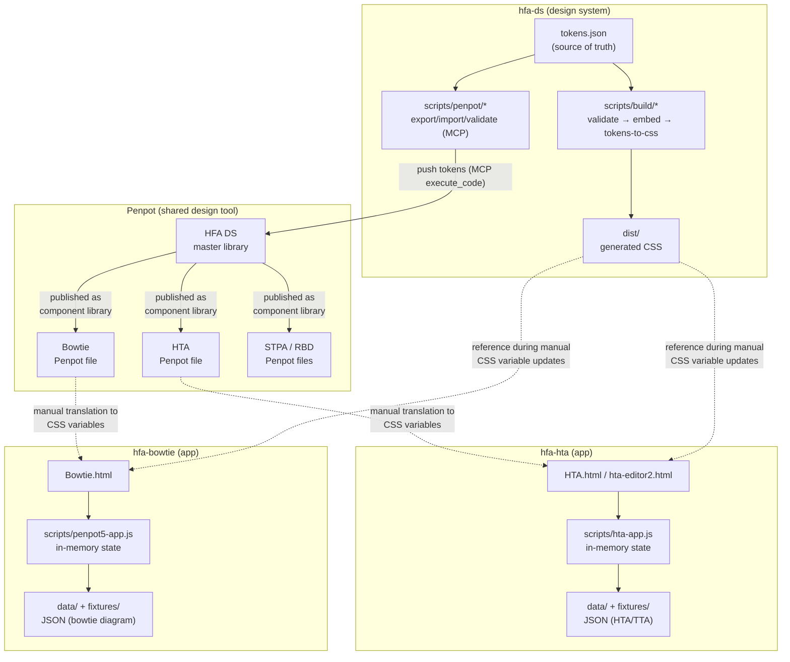
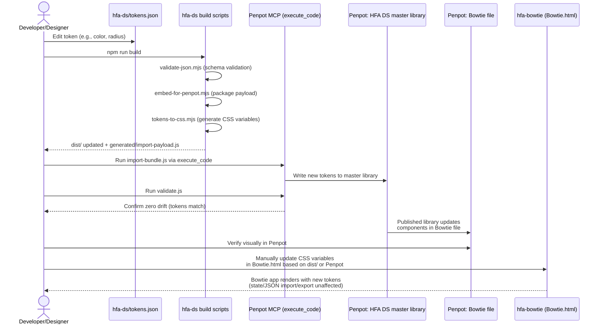

# Architecture: The HFA Family (hfa-ds, hfa-hta, hfa-bowtie)

## 1. Purpose and Structure

This document describes the architecture of three related repositories within the Human Factors Analysis (HFA) family:

- **hfa-ds** – Design system repository. Contains no runnable applications, but is the single source of truth for design tokens (colors, typography, radii, etc.) as well as build scripts and Penpot sync tools that keep a central Penpot design library and consumer projects' Penpot files in sync. Runs on Node.js (ESM), no runtime dependencies.
- **hfa-hta** – Standalone web tool for Hierarchical Task Analysis (HTA) combined with Tabular Task Analysis (TTA)/HEI fields. Pure vanilla JS/HTML/CSS without build steps, runs by opening HTML files directly in the browser.
- **hfa-bowtie** – Standalone web tool for drawing and editing bowtie diagrams (risk: causes → top event/hazard → consequences, with barriers). Also pure vanilla JS/HTML/CSS without build steps.

Shared purpose: support safety and human factors analysis through separate, focused in-browser editors, while maintaining visual consistency (colors, fonts, component appearance) via a shared design system in Penpot, sourced from `hfa-ds`.

**Important architectural characteristic:** There is **no code coupling** (no npm packages, no shared JS modules, no API calls) between the three repositories. All coupling occurs indirectly via:
1. Penpot as shared design tool – `hfa-ds` owns master tokens and syncs them to each consumer's Penpot file via MCP scripts.
2. Manually maintained design conventions (CSS variables in respective HTML files that should mirror `hfa-ds/tokens.json`).

Neither hfa-hta nor hfa-bowtie have `package.json` or any build steps – they are static pages that run directly in the browser, with Python-based smoke tests for regression testing.

## 2. Component Diagram – Communication Between Repositories

**Key points in the diagram:**
- `hfa-ds` is the only node with a build pipeline (validation → packaging → CSS generation) and the only one that talks to Penpot MCP for sync.
- Penpot acts as an intermediary/hub: tokens flow in from `hfa-ds` and are published out as component libraries to each consumer file (Bowtie, HTA, STPA, RBD).
- `hfa-hta` and `hfa-bowtie` follow the same architectural pattern: a single HTML page, one large vanilla-JS file that owns all state in memory, and JSON-based import/export for persistence (no backend, no database).
- Dashed lines show manual/non-automated couplings (design → code), in contrast to script-driven MCP flows.

## 3. Sequence Diagram – Main Flow: Token Sync from hfa-ds to a Consumer App

This is the primary architectural use case: a designer/developer changes a design token in `hfa-ds` and propagates it to a consumer app (e.g., `hfa-bowtie`).

**Note:** Because `hfa-hta` and `hfa-bowtie` lack build steps and package dependencies, the final step (code update) is manual – this is a deliberate design tradeoff in the project family (simple, dependency-free HTML apps) rather than incomplete integration.
