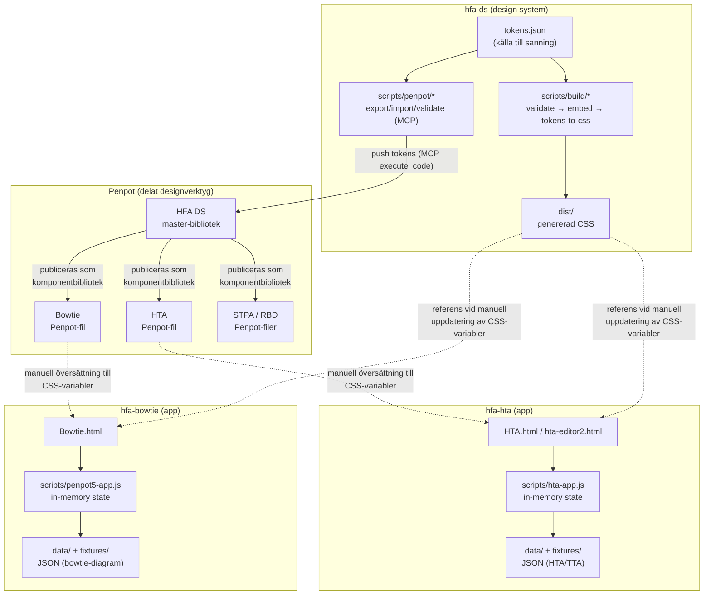
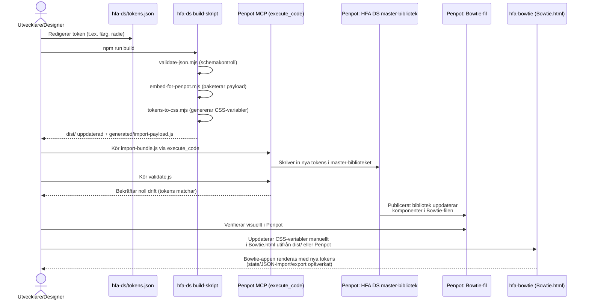

# Arkitektur: HFA-familjen (hfa-ds, hfa-hta, hfa-bowtie)

## 1. Syfte och struktur

Detta dokument beskriver arkitekturen för tre relaterade repon inom Human Factors Analysis (HFA)-familjen:

- **hfa-ds** – Design system-repot. Innehåller inga körbara applikationer, utan är sanningskällan för designtokens (färger, typografi, radier m.m.) samt byggskript och Penpot-synk-verktyg som håller ett centralt Penpot-designbibliotek och konsumentprojektens Penpot-filer i synk. Drivs med Node.js (ESM), inga runtime-beroenden.
- **hfa-hta** – Fristående webbverktyg för Hierarchical Task Analysis (HTA) kombinerat med Tabular Task Analysis (TTA)/HEI-fält. Ren vanilla JS/HTML/CSS utan build-steg, körs genom att öppna HTML-filer direkt i webbläsaren.
- **hfa-bowtie** – Fristående webbverktyg för att rita och redigera bowtie-diagram (risk: orsaker → toppelement/hot → konsekvenser, med barriärer). Även detta ren vanilla JS/HTML/CSS utan build-steg.

Gemensamt syfte: stödja säkerhets- och human factors-analys genom separata, fokuserade in-browser-editorer, medan visuell konsekvens (färger, typsnitt, komponentutseende) hålls samman via ett delat designsystem i Penpot, sprunget ur `hfa-ds`.

**Viktigt arkitekturdrag:** Det finns **ingen kodkoppling** (inga npm-paket, inga delade JS-moduler, inga API-anrop) mellan de tre repona. All koppling sker indirekt via:
1. Penpot som delat designverktyg – `hfa-ds` äger master-tokens och synkar dem till varje konsuments Penpot-fil via MCP-skript.
2. Manuellt underhållna designkonventioner (CSS-variabler i respektive HTML-fil som ska spegla `hfa-ds/tokens.json`).

Varken hfa-hta eller hfa-bowtie har `package.json` eller något buildsteg – de är statiska sidor som körs direkt i webbläsaren, med Python-baserade smoke-tester för regressionstest.

## 2. Komponentdiagram – kommunikation mellan repon

**Nyckelpunkter i diagrammet:**
- `hfa-ds` är den enda noden med byggpipeline (validering → paketering → CSS-generering) och den enda som pratar med Penpot MCP för synk.
- Penpot fungerar som mellanlager/knutpunkt: tokens flödar in från `hfa-ds` och publiceras ut som komponentbibliotek till varje konsumentfil (Bowtie, HTA, STPA, RBD).
- `hfa-hta` och `hfa-bowtie` är arkitektoniskt identiska mönster: en enskild HTML-sida, en stor vanilla-JS-fil som äger allt state i minnet, och JSON-baserad import/export för persistens (ingen backend, ingen databas).
- Streckade linjer visar manuella/icke-automatiserade kopplingar (design → kod), till skillnad från de skriptdrivna MCP-flödena.

## 3. Sekvensdiagram – huvudflöde: token-synk från hfa-ds till en konsumentapp

Detta är det primära arkitekturella användningsfallet: en designer/utvecklare ändrar ett designtoken i `hfa-ds` och sprider det till en konsumentapp (t.ex. `hfa-bowtie`).

**Kommentar:** Eftersom `hfa-hta` och `hfa-bowtie` saknar byggsteg och paketberoenden är det sista steget (kod-uppdatering) manuellt – detta är en medveten designavvägning i projektfamiljen (enkla, beroendefria HTML-appar) snarare än en ofullständig integration.
