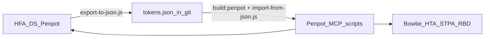

# Token sync workflow

## Architecture

## Edit in Penpot (design-led)

1. Change tokens in **HFA DS** Penpot file
2. MCP: `export-to-json.js` → update `tokens.json` → commit (tag optional)
3. `npm run build:penpot`
4. For each consumer (HFA DS, Bowtie, HTA, STPA, RBD):
   - Connect file in MCP
   - Paste `generated/import-payload.js` + `import-from-json.js`
   - Run `validate.js`
5. Visual check Components page + one canvas per app

## Edit in git (code-led)

1. Edit `tokens.json`, `npm run validate`, commit
2. `npm run build:penpot`
3. Import order: **HFA DS → Bowtie → HTA → STPA → RBD**
4. Validate each file

## Legacy cleanup

| File | Remove after import |
|---|---|
| STPA | Deactivate/delete `Global` token set |
| RBD | Delete duplicate local `mode/light` + `mode/dark` only after imported sets work |
| All | No bare `foreground` — use `foreground.base` |

## App repos (Bowtie, HTA, RBD, STPA)

No `tokens.json` in app git repos. Clone [hfa-ds](https://github.com/larswpettersson/hfa-ds) separately and use its MCP scripts to push tokens into each Penpot file.

## Cursor multi-root workspace

Open `Projects/HFA/hfa-design.code-workspace` (or `Projects/hfa-design.code-workspace`) to edit `hfa-ds` and app repos side by side.
